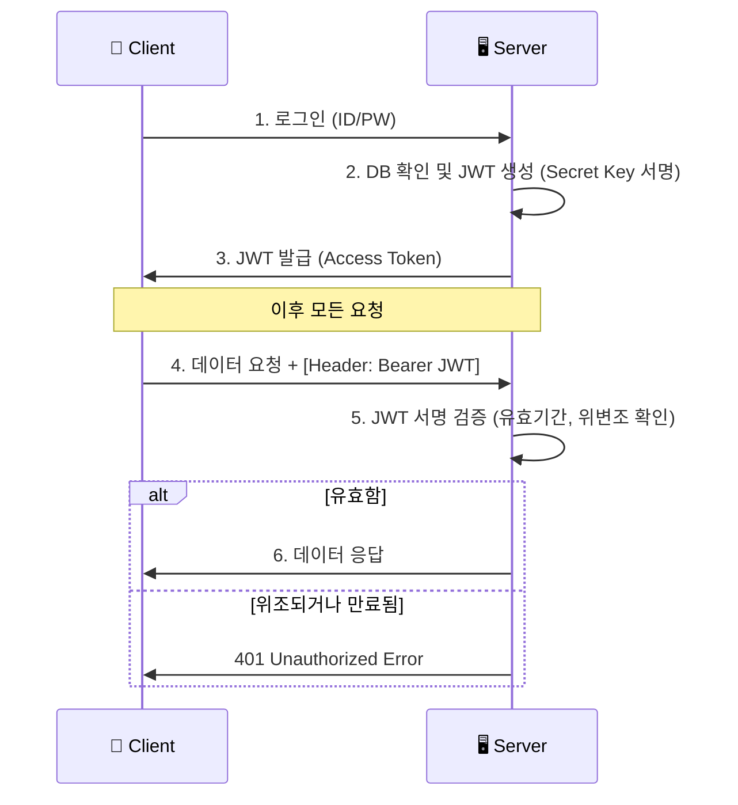

# 사용자 식별의 기술: 인증(Authentication) vs 인가(Authorization)

## 1. 핵심 요약 (Executive Summary)

보안의 시작은 "네가 누구냐?"를 확인하는 것과 "네가 무엇을 할 수 있느냐?"를 구분하는 것이다. 과거 모놀리식 환경에서는 **세션(Session)** 방식이 절대적이었으나, 마이크로서비스(MSA)와 모바일 환경이 대세가 되면서 **토큰(JWT)** 방식이 표준으로 자리 잡았다.

> **결론:**
> 1. **구분:** **인증(Login)**은 신분증 검사, **인가(Permission)**는 출입증 발급이다.
> 2. **선택:** PC 웹 위주의 높은 보안이 필요하면 **Session**, 앱/MSA 환경의 확장성이 필요하면 **JWT**를 사용한다.
> 3. **저장:** 보안을 위해 JWT는 로컬 스토리지보다 **HttpOnly Cookie**에 저장하는 것이 권장된다.
> 
> 

---

## 2. 개념 비교: 인증 vs 인가

| 구분 | 영어 (Abbr.) | 질문 | 비유 | 예시 |
| --- | --- | --- | --- | --- |
| **인증** | **AuthN** (Authentication) | **Who are you?** (너 누구니?) | 입국 심사 (여권 확인) | 로그인(ID/PW), 지문 인식 |
| **인가** | **AuthZ** (Authorization) | **What can you do?** (뭐 할 수 있니?) | 탑승권 확인 (이코노미/비즈니스) | '관리자 페이지' 접근 권한, '글쓰기' 권한 |

---

## 3. 세션(Session) vs 토큰(JWT) 논쟁

서버가 사용자의 로그인 상태를 **어떻게 기억하느냐**의 차이다.

### 3.1 세션 (Stateful)

* **방식:** 서버의 메모리(또는 DB/Redis)에 "철수 로그인했음"이라고 적어두고, 철수에게는 `Session-ID`라는 번호표(쿠키)만 준다.
* **장점:** 보안성이 높다. 철수가 해킹당하면 서버에서 "철수 로그아웃" 시키면 끝이다 (강제 만료 가능).
* **단점:** 사용자가 많아지면 서버 메모리가 터진다. 서버가 여러 대면 세션 공유(Session Clustering) 처리가 복잡하다.

### 3.2 JWT (Stateless)

* **방식:** 서버는 아무것도 기억하지 않는다. 대신 철수에게 **"철수 인증됨(서버 도장 쾅!)"**이라고 적힌 암호화된 종이(**Token**)를 준다. 철수는 요청할 때마다 이 종이를 보여준다.
* **장점:** 서버 확장이 무한대로 가능하다(Scale-out). 모바일 앱에서 쓰기 좋다.
* **단점:** 종이(토큰)를 도둑맞으면 답이 없다. (유효기간이 만료될 때까지 해커가 씀). 또한 토큰 길이가 길어서 트래픽 낭비가 있다.

---

## 4. JWT (JSON Web Token) 구조

JWT는 `.`을 구분자로 하여 세 부분으로 나뉜다. `aaaaa.bbbbb.ccccc`

1. **Header:** 토큰의 타입(JWT)과 암호화 알고리즘(HS256 등).
2. **Payload (내용):** 실제 데이터(Claim). `User ID`, `유효기간(exp)`, `권한(role)` 등이 들어간다.
* **⚠️ 경고:** 여기는 **암호화되지 않고 Base64로 인코딩**만 된 것이다. 즉, **누구나 내용을 볼 수 있다.** 비밀번호나 민감 정보를 절대 넣으면 안 된다.


3. **Signature (서명):** Header + Payload + **서버만의 비밀키(Secret Key)**를 조합해 만든 서명. 위변조를 검증하는 핵심.

### 4.1 JWT 인증 흐름도 (Mermaid)



---

## 5. OAuth 2.0: "구글로 로그인"의 정체

내 서비스가 사용자의 구글 비밀번호를 받지 않고도, 구글의 사용자 정보에 접근할 수 있게 해주는 **인가 프레임워크**다.

### 5.1 핵심 참여자

1. **Resource Owner:** 사용자 (나)
2. **Client:** 내 서비스 (웹/앱)
3. **Authorization Server:** 구글 로그인 서버
4. **Resource Server:** 구글 API 서버 (유저 정보, 캘린더 등)

### 5.2 작동 원리 (Authorization Code Grant)

가장 표준적인 방식이다.

1. 사용자가 "구글 로그인" 버튼 클릭.
2. 구글 로그인 창으로 이동  로그인  "이 앱이 네 이메일을 보려는데 허락할래?"
3. 승인하면 구글이 내 서비스에 **임시 코드(Auth Code)**를 준다.
4. 내 서비스는 이 **Code**와 **내 앱 비밀키(Client Secret)**를 들고 구글 서버에 가서 **"진짜 토큰(Access Token)"**으로 교환한다.
5. 이제 이 토큰으로 구글 API를 사용한다.

---

## 6. Production-Ready Code Example (Python)

JWT를 생성하고 검증하는 로직이다. `PyJWT` 라이브러리를 사용한다.

```python
import jwt
import datetime

SECRET_KEY = "my_super_secret_key_never_share"

# 1. 토큰 생성 (로그인 성공 시)
def create_access_token(user_id: str):
    payload = {
        "sub": user_id,  # Subject (유저 식별자)
        "role": "admin",
        # [중요] 만료 시간 설정 필수 (짧게 가져가는 것이 좋음, 예: 30분)
        "exp": datetime.datetime.utcnow() + datetime.timedelta(minutes=30)
    }
    # HS256 알고리즘으로 서명
    token = jwt.encode(payload, SECRET_KEY, algorithm="HS256")
    return token

# 2. 토큰 검증 (API 요청 시)
def verify_token(token: str):
    try:
        # 서명이 맞는지, 만료되지 않았는지 확인
        payload = jwt.decode(token, SECRET_KEY, algorithms=["HS256"])
        return payload["sub"] # User ID 반환
    except jwt.ExpiredSignatureError:
        raise Exception("토큰이 만료되었습니다. 다시 로그인하세요.")
    except jwt.InvalidTokenError:
        raise Exception("유효하지 않은 토큰입니다.")

# Test
jwt_token = create_access_token("user_123")
print(f"Generated JWT: {jwt_token}")

```

---

## 7. 전문가적 조언 (Pro Tip)

### 7.1 Access Token & Refresh Token 전략

JWT의 단점(탈취 시 답 없음)을 보완하는 표준 전략이다.

* **Access Token:** 유효기간을 **30분 이내**로 짧게 설정. 탈취당해도 피해를 최소화.
* **Refresh Token:** 유효기간을 **2주~1달**로 길게 설정. DB나 Redis에 저장.
* **Flow:** Access Token이 만료되면(401 에러), 클라이언트는 Refresh Token을 서버로 보내 "새 Access Token 줘"라고 요청한다. 이때 서버는 Refresh Token이 유효한지 DB에서 확인 후 재발급한다. (로그아웃 시 DB의 Refresh Token을 지우면 된다.)

### 7.2 어디에 저장해야 하는가? (XSS vs CSRF)

프론트엔드 개발자의 영원한 난제다.

* **LocalStorage:** 자바스크립트로 접근 가능. 해커가 스크립트를 심으면(XSS) 토큰을 바로 훔쳐갈 수 있다. (편리하지만 위험)
* **HttpOnly Cookie:** 자바스크립트로 접근 불가. XSS 방어에 유리하다. 하지만 CSRF 공격(내 의지와 상관없이 요청이 날아감)에 취약하다.
* **권장:** **Refresh Token은 HttpOnly Cookie**에 저장하고, CSRF 토큰 방식이나 SameSite 쿠키 설정을 통해 방어하는 것이 보안상 가장 안전하다.
