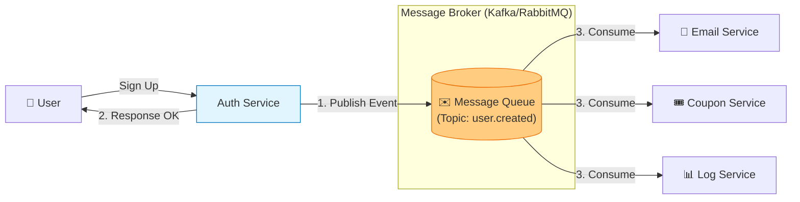

# 시스템의 충격 흡수 장치: 메시지 큐(Kafka, RabbitMQ)

## 1. 핵심 요약 (Executive Summary)

서버 A가 서버 B에게 직접 요청을 보내고 응답을 기다리는(HTTP) 방식은 **강한 결합(Tightly Coupled)**을 초래하여, B가 죽으면 A도 같이 죽는 연쇄 장애를 유발한다. **메시지 큐(Message Queue)**는 이 둘 사이에 임시 저장소(Broker)를 두어 연결을 끊고, 데이터를 비동기로 전달하는 완충 장치다.

> **결론:**
> 1. **목적:** 느슨한 결합(Decoupling), 비동기 처리(Fire & Forget), 트래픽 깎기(Throttling).
> 2. **선택 기준:**
> * 복잡한 라우팅, 메시지 배달 보장이 중요하면  **RabbitMQ** (전통적 MQ)
> * 대용량 데이터 스트리밍, 로그 수집, 재생(Replay)이 필요하면  **Kafka** (이벤트 브로커)
> 
> 
> 
> 

---

## 2. 동기(Synchronous) vs 비동기(Asynchronous) 비교

### 2.1 동기 방식 (HTTP API)

* **시나리오:** 회원가입(A)  이메일 발송 요청(B)  B 완료 대기  A 완료 응답.
* **문제점:**
1. **속도:** 이메일 서버가 느리면 회원가입 전체가 느려짐.
2. **장애 전파:** 이메일 서버가 죽으면 회원가입 자체가 실패함 (치명적).


### 2.2 비동기 방식 (Message Queue)

* **시나리오:** 회원가입(A)  "가입했음" 메시지를 큐에 던짐(Publish)  A 즉시 완료 응답. (사용자는 빠름)  이메일 서버(B)가 나중에 큐에서 메시지를 꺼내서(Consume) 발송.
* **장점:**
1. **빠른 응답:** 사용자는 이메일 발송을 기다리지 않음.
2. **장애 격리:** 이메일 서버가 죽어도 큐에 메시지가 쌓여 있을 뿐, 회원가입은 정상 동작함. 나중에 서버가 살아나면 처리하면 됨.


---

## 3. 아키텍처 다이어그램 (Event-Driven Architecture)

가장 대표적인 사용 사례인 **"회원가입 후 후처리"** 프로세스입니다.



---

## 4. RabbitMQ vs Kafka: 무엇을 써야 하는가?

둘 다 메시지를 주고받지만, 설계 철학과 용도가 완전히 다르다.

| 구분 | RabbitMQ | Apache Kafka |
| --- | --- | --- |
| **기본 철학** | **"똑똑한 브로커, 멍청한 컨슈머"** <br>

<br> 브로커가 메시지 전달 상태를 관리함. | **"멍청한 브로커, 똑똑한 컨슈머"** <br>

<br> 브로커는 파일시스템에 저장만 하고, 관리는 컨슈머가 함. |
| **메시지 보존** | 소비(Ack)되면 **삭제됨**. (휘발성) | 소비되어도 디스크에 **남아있음**. (설정 기간 동안) |
| **처리량(Throughput)** | 초당 수만 건 (안정성 중시) | 초당 수백만 건 (속도 중시) |
| **주요 용도** | 복잡한 라우팅(1:1, 1:N), 작업 큐(Task Queue), 즉시 처리 | 대용량 로그 수집, 실시간 스트리밍, 이벤트 소싱 |
| **프로토콜** | AMQP (표준 프로토콜) | TCP 기반 바이너리 프로토콜 (자체) |

> **Pro Tip:**
> * 단순히 "이메일 보내기", "푸시 알림 보내기" 같은 **작업(Task)** 위주라면 **RabbitMQ** (또는 AWS SQS)가 관리하기 훨씬 편합니다.
> * "사용자 클릭 로그 전수 수집", "CDC(DB 변경 감지)" 같은 **데이터 파이프라인**이라면 **Kafka**가 표준입니다.
> 
> 

---

## 5. Production-Ready Code Example (Python + RabbitMQ)

RabbitMQ의 Python 클라이언트인 `pika`를 사용한 생산자(Producer)와 소비자(Consumer) 패턴입니다.

### 5.1 Producer (회원가입 서버)

```python
import pika
import json

# 연결 설정 (실무에선 커넥션 풀 사용 권장)
connection = pika.BlockingConnection(pika.ConnectionParameters('localhost'))
channel = connection.channel()

# 큐 선언 (durable=True: 브로커가 재시작되어도 큐 유지)
channel.queue_declare(queue='email_task_queue', durable=True)

def sign_up_user(user_data):
    # 1. DB 저장 로직 (생략)
    print(f"DB Saved: {user_data['id']}")
    
    # 2. 메시지 발행 (Fire & Forget)
    message = json.dumps(user_data)
    channel.basic_publish(
        exchange='',
        routing_key='email_task_queue',
        body=message,
        properties=pika.BasicProperties(
            delivery_mode=2,  # 메시지를 디스크에 영구 저장 (Persistent)
        ))
    print(" [x] Sent Email Task")

sign_up_user({'id': 1, 'email': 'user@example.com'})
connection.close()

```

### 5.2 Consumer (이메일 발송 서버)

```python
import pika
import time
import json

connection = pika.BlockingConnection(pika.ConnectionParameters('localhost'))
channel = connection.channel()
channel.queue_declare(queue='email_task_queue', durable=True)

def callback(ch, method, properties, body):
    user_data = json.loads(body)
    print(f" [>] Received task for: {user_data['email']}")
    
    try:
        # 3. 실제 이메일 발송 로직 (SMTP 등)
        time.sleep(2) # 모의 지연 시간
        print(" [v] Email Sent")
        
        # 4. [중요] 처리 완료 신호 (Ack)
        # 이걸 안 보내면 큐는 처리가 안 된 줄 알고 다른 워커에게 다시 줌
        ch.basic_ack(delivery_tag=method.delivery_tag)
        
    except Exception as e:
        # 실패 시 로직 (재시도 혹은 Dead Letter Queue로 이동)
        print(f" [!] Error: {e}")
        ch.basic_nack(delivery_tag=method.delivery_tag, requeue=False)

# 공평 분배 (워커가 바쁘면 일 주지 마라)
channel.basic_qos(prefetch_count=1)
channel.basic_consume(queue='email_task_queue', on_message_callback=callback)

print(' [*] Waiting for messages. To exit press CTRL+C')
channel.start_consuming()

```

---

## 6. 전문가적 조언 (Pro Tip)

### 6.1 멱등성 (Idempotency) 보장 필수

메시지 큐는 네트워크 문제로 인해 **"적어도 한 번(At-least-once)"** 전송을 보장하는 경우가 많습니다. 즉, **같은 메시지가 두 번 올 수 있습니다.**

* **문제:** 이메일 발송 서버가 같은 메시지를 두 번 받으면, 유저에게 가입 환영 메일이 두 통 날아갑니다.
* **해결:** Consumer는 반드시 멱등성을 가져야 합니다.
* 메시지 ID를 Redis에 저장하여 `if exists(msg_id): skip` 처리를 하거나,
* 로직 자체가 여러 번 수행되어도 결과가 같도록 설계해야 합니다.


### 6.2 Dead Letter Queue (DLQ)

코드 버그나 데이터 문제로 인해 소비자가 **영원히 처리할 수 없는 메시지**가 들어올 수 있습니다.

* 이 메시지를 계속 재시도(Retry)하면 큐가 막혀버립니다(Head-of-line blocking).
* **전략:** 3~5회 재시도 후에도 실패하면, 해당 메시지를 별도의 **"죽은 편지함(DLQ)"**으로 옮기고 `Ack` 처리합니다. 이후 개발자가 DLQ를 모니터링하여 원인을 분석하고 수동 처리합니다.

### 6.3 메시지 순서 보장 (Ordering)

큐를 쓰면서 순서를 100% 보장하는 것은 매우 어렵고 성능 비용이 큽니다.

* 특히 여러 개의 Consumer(Worker)가 동시에 큐를 파먹을 때 순서가 뒤섞일 수 있습니다.
* 순서가 중요하다면(예: 결제 생성  결제 완료), Kafka의 파티셔닝(Partitioning) 키를 유저 ID로 설정하여 **"특정 유저의 메시지는 항상 같은 파티션(같은 순서)"**으로 가도록 설계해야 합니다.
