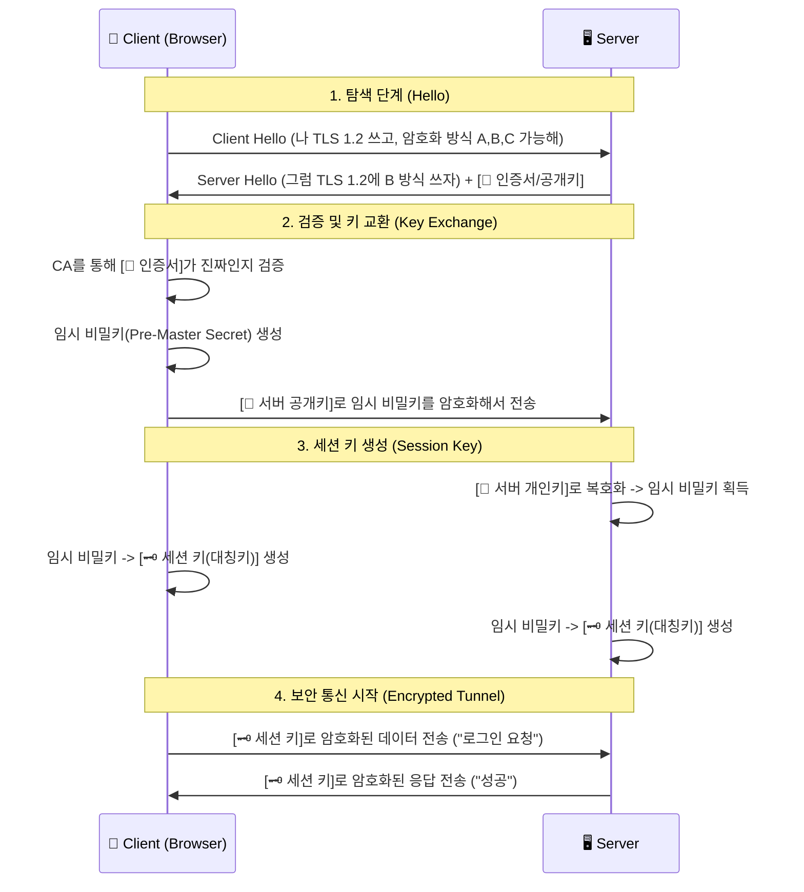

# 웹의 통신 규약: HTTP vs HTTPS와 암호화의 원리

## 1. 핵심 요약 (Executive Summary)

**HTTP(HyperText Transfer Protocol)**는 인터넷상에서 정보를 주고받기 위한 프로토콜이다. 하지만 HTTP는 데이터를 '있는 그대로(Plain Text)' 보내기 때문에, 중간에 누군가가 패킷을 가로채면 비밀번호나 카드 정보를 100% 볼 수 있다. 이를 해결하기 위해 **보안 껍데기(SSL/TLS)**를 씌운 것이 **HTTPS**다.

> **결론:** 현대의 모든 웹 서비스는 선택이 아닌 **필수적으로 HTTPS**를 적용해야 한다. (검색 엔진 최적화(SEO), 보안, 최신 브라우저 기능(PWA, 위치 정보 등) 사용을 위해 필수)

---

## 2. HTTP vs HTTPS 비교

| 구분 | HTTP | HTTPS (HTTP + Secure) |
| --- | --- | --- |
| **개념** | 텍스트 평문 전송 | SSL/TLS로 암호화된 전송 |
| **보안성** | **취약함** (도청/변조 가능) | **강력함** (도청 불가, 위조 방지) |
| **기본 포트** | 80번 | 443번 |
| **속도** | 암호화 과정이 없어 빠름 (이론상) | 핸드셰이크 부하가 있으나, 현대 하드웨어와 HTTP/2로 극복됨 |
| **필요 요소** | 없음 | **SSL 인증서** (CA 발급 필요) |

---

## 3. 핵심 원리: 하이브리드 암호화 시스템

HTTPS는 **비대칭키** 방식과 **대칭키** 방식을 섞어서 사용한다. **"왜 하나만 쓰지 않고 섞어 쓰는가?"**가 핵심 질문이다.

1. **비대칭키 (공개키/개인키):** 보안성은 높지만, 계산 비용이 비싸고 **느리다**.
*  **접속 초기(Handshake)**에만 사용하여 '대칭키'를 안전하게 교환하는 용도로 쓴다.

2. **대칭키:** 계산 비용이 싸고 **빠르다**.
*  **실제 데이터 통신** 시에는 이 키를 사용하여 빠르게 통신한다.

---

## 4. SSL/TLS Handshake 과정 (Deep Dive)

클라이언트(브라우저)와 서버가 보안 연결을 맺기 위해 서로를 확인하고 암호화 키를 나누는 과정이다. (TLS 1.2/1.3 기준 단순화)

### 4.1 시퀀스 다이어그램 (Mermaid)

### 4.2 단계별 상세 설명

1. **Client Hello:** 브라우저가 서버에 말을 건다. "나 이런 암호화 방식(Cipher Suite) 지원해."
2. **Server Hello & Certificate:** 서버가 응답한다. "그래, 그중 이걸로 하자." 그리고 자신의 신분증(**SSL 인증서**)을 건넨다. 이 인증서 안에 서버의 **공개키(Public Key)**가 들어있다.
3. **Certificate Verification:** 브라우저는 내장된 '신뢰할 수 있는 기관(CA) 리스트'를 확인하여 이 인증서가 유효한지 검증한다. (위조된 사이트인지 판별)
4. **Key Exchange (핵심):**
* 브라우저는 **대칭키(세션 키)**의 재료가 될 랜덤 문자열을 만든다.
* 이것을 **서버의 공개키**로 암호화해서 보낸다. (이제 이 내용은 세상에서 오직 서버만 자신의 **개인키**로 열어볼 수 있다.)

5. **Session Key Generation:** 서버는 개인키로 암호문을 열어 재료를 얻는다. 이제 양쪽 모두 동일한 **세션 키(대칭키)**를 갖게 되었다.
6. **Secure Communication:** 이후의 모든 데이터(HTML, JSON 등)는 **세션 키**로 빠르게 암호화/복호화하며 주고받는다.

---

## 5. 실무 이슈: 인증서 에러가 뜨는 이유

### 5.1 "연결이 비공개로 설정되어 있지 않습니다" (Connection Not Private)

브라우저 주소창에 빨간 줄이 뜨는 경우, 대부분 다음 중 하나다.

1. **기간 만료 (Expired):** SSL 인증서는 유효 기간(보통 90일~1년)이 있다. 갱신을 잊은 경우.
2. **도메인 불일치 (Domain Mismatch):** `www.example.com`용 인증서를 발급받고 `api.example.com`에 적용한 경우. (와일드카드 인증서 `*.example.com` 필요)
3. **자가 서명 (Self-Signed):** 개발자가 로컬에서 스스로 만든 인증서인 경우. (브라우저는 공인된 CA(기관)가 보증한 것만 신뢰함)

### 5.2 Mixed Content (혼합된 콘텐츠) 경고

HTTPS 사이트(`https://site.com`) 안에서 HTTP 리소스(`http://site.com/image.jpg`)를 불러오려 할 때 발생한다.

* **보안 위험:** 암호화된 페이지 안에서 암호화되지 않은 스크립트가 실행되면 보안이 뚫린 것과 같다.
* **해결:** 모든 리소스(이미지, API 호출, 스크립트) 경로를 `https://`로 변경하거나, 프로토콜 생략(`//site.com/image.jpg`)을 사용해야 한다.

---

### 6.1 무료 인증서: Let's Encrypt

과거에는 인증서가 비쌌지만, 지금은 **Let's Encrypt**를 통해 무료로 자동 발급/갱신이 가능하다. `Certbot` 같은 도구를 서버에 설치하면 만료 30일 전에 알아서 갱신해 준다. 실무에서는 Nginx/Apache 설정과 연동하여 자동화하는 것이 표준이다.

### 6.2 HSTS (HTTP Strict Transport Security)

사용자가 `http://naver.com`이라고 쳐도 강제로 `https`로 연결하고 싶다면? 서버 헤더에 **HSTS**를 설정해야 한다.

* **기능:** 브라우저에게 "내 사이트는 앞으로 무조건 HTTPS로만 접속해. HTTP로 시도하면 네가 알아서 바꿔줘"라고 명령하는 헤더다.
* **효과:** 중간자 공격(SSL Stripping)을 원천 차단하여 보안성을 극대화한다.

### 6.3 HTTP/2와 HTTP/3 (QUIC)

HTTPS는 느리지 않다. 오히려 최신 프로토콜인 HTTP/2와 HTTP/3는 **HTTPS 위에서만 동작**한다.

* **HTTP/2:** 하나의 연결로 여러 파일을 동시에 전송(Multiplexing)하여 속도 혁신.
* **HTTP/3 (QUIC):** TCP 대신 UDP를 사용하여 핸드셰이크 과정을 획기적으로 줄임.

---
