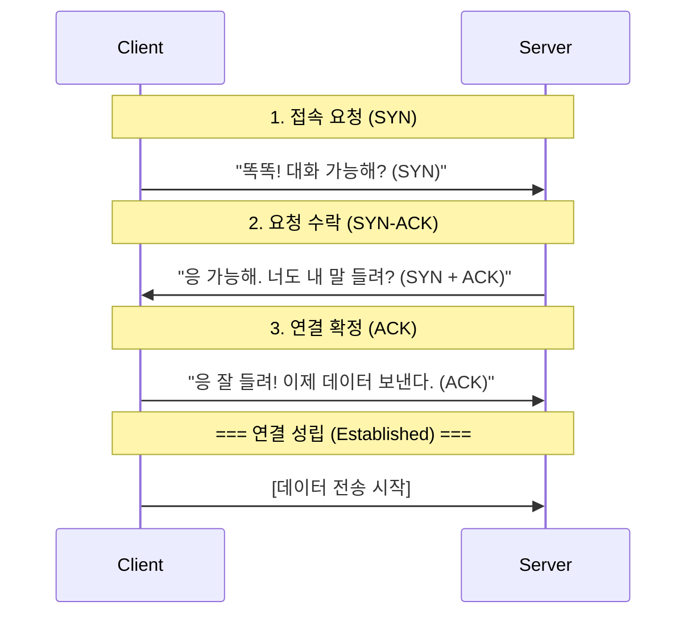

# 전송 계층의 두 거인: TCP vs UDP

## 1. 핵심 요약 (Executive Summary)

인터넷상에서 데이터를 주고받을 때 사용하는 두 가지 표준 프로토콜이다.

* **TCP (Transmission Control Protocol):** **"등기 우편(택배)"**. 받는 사람이 잘 받았는지 확인(Ack)하고, 분실되면 재발송한다. 느리지만 정확하다.
* **UDP (User Datagram Protocol):** **"일반 우편(종이비행기)"**. 그냥 던진다. 받는 사람이 받았는지 확인하지 않는다. 분실되어도 책임지지 않지만 매우 빠르다.

> **결론:**
> * **웹, 이메일, 파일 전송:** 데이터가 1비트라도 깨지면 안 되는 경우  **TCP** 필수.
> * **스트리밍, 게임, VoIP:** 렉(Lag)이 없어야 하고, 중간에 프레임 하나 정도 깨져도 되는 경우  **UDP** 필수.
> 
> 

---

## 2. 상세 비교 (Comparison)

| 특징 | TCP (신뢰성 중심) | UDP (속도 중심) |
| --- | --- | --- |
| **연결 방식** | **연결 지향형 (Connection-oriented)** <br>

<br> 3-Way Handshake로 길을 먼저 닦음. | **비연결형 (Connectionless)** <br>

<br> 사전 작업 없이 바로 데이터 쏘기 시작. |
| **신뢰성** | **높음.** <br>

<br> 순서 보장, 패킷 분실 시 재전송. | **낮음.** <br>

<br> 순서 뒤섞임 가능, 분실 시 그냥 버림. |
| **속도** | 상대적으로 느림 (확인 절차, 헤더 큼) | 매우 빠름 (확인 절차 없음, 헤더 작음) |
| **전송 단위** | Segment (스트림 방식) | Datagram (패킷 방식) |
| **헤더 크기** | 최소 **20 Bytes** (기능이 많음) | **8 Bytes** (아주 단순함) |
| **대표 서비스** | HTTP(Web), FTP, SMTP(Email) | DNS, Streaming(Youtube), FPS 게임, VoIP |

---

## 3. TCP의 핵심: 3-Way Handshake

TCP는 통신을 시작하기 전에 "너 내 말 들려? 응 잘 들려" 과정을 반드시 거쳐야 한다.

### 3.1 연결 수립 과정 (Connection Establishment)



* **SYN (Synchronize Sequence Number):** 연결 요청 플래그.
* **ACK (Acknowledgment):** 응답 플래그.

> **참고:** 연결을 끊을 때는 4번 왔다 갔다 하는 **4-Way Handshake**를 사용한다.

---

## 4. 왜 UDP를 쓰는가? (Why UDP?)

TCP가 이렇게 완벽해 보이는데, 왜 불안정한 UDP를 사용할까?

### 4.1 실시간성 (Real-time Performance)

* **상황:** 라이브 축구 중계를 보는데 10초 전 장면의 픽셀 하나가 깨졌다.
* **TCP:** 깨진 픽셀을 다시 받아오느라 영상을 멈추고(Buffering), 재전송받은 뒤 10초 전 장면을 다시 보여준다.  **방송 사고**
* **UDP:** 깨진 픽셀은 그냥 뭉개진 채로 두고, **지금 현재**의 장면을 바로 보여준다.  **원활한 시청**

### 4.2 서버 부하 감소

* UDP는 누가 받았는지 기억할 필요(State)가 없다. 따라서 서버가 더 많은 클라이언트를 감당할 수 있다. (DNS 서버가 UDP를 쓰는 주된 이유)

---

## 5. Production Code Example (Python Socket)

**[TCP Client]**
전화를 거는 것과 같다. `connect`가 성공해야 말을 할 수 있다.

```python
import socket

# SOCK_STREAM = TCP
sock = socket.socket(socket.AF_INET, socket.SOCK_STREAM)

# 1. 연결 (3-Way Handshake 발생)
sock.connect(('127.0.0.1', 8080))

# 2. 송신 (Reliable)
sock.sendall(b'Hello TCP')

# 3. 수신
data = sock.recv(1024)
sock.close()

```

**[UDP Client]**
편지를 우통에 넣는 것과 같다. 상대가 있든 없든 일단 보낸다.

```python
import socket

# SOCK_DGRAM = UDP
sock = socket.socket(socket.AF_INET, socket.SOCK_DGRAM)

# 연결 과정 없음 (No connect)

# 1. 송신 (Fire and Forget)
# 주소를 패킷마다 명시해야 함
sock.sendto(b'Hello UDP', ('127.0.0.1', 8080))

sock.close()

```

---

## 6. 전문가적 조언 (Pro Tip)

### 6.1 TCP의 치명적 약점: HOL Blocking

TCP는 데이터 순서를 보장해야 하므로, **앞선 패킷 하나가 손실되면 그 뒤에 도착한 정상 패킷들도 줄줄이 대기(Blocking)**해야 한다. 이를 **Head-of-Line Blocking**이라 한다.

* 이 문제 때문에 HTTP/1.1, HTTP/2에서 속도 저하가 발생했다.

### 6.2 HTTP/3와 QUIC (Game Changer)

구글과 IT 업계는 "TCP는 너무 느리고 무겁다"고 판단했다. 그래서 **UDP 기반**으로 TCP의 신뢰성 기능을 소프트웨어적으로 구현한 **QUIC** 프로토콜을 만들었고, 이것이 **HTTP/3**의 표준이 되었다.

* **핵심:** 전송 계층은 빠른 UDP를 쓰되, 신뢰성 제어는 애플리케이션 레벨에서 알아서 하겠다는 전략.

### 6.3 헬스 체크(Health Check)와 Keep-Alive

TCP는 연결 비용(3-Way Handshake)이 비싸다.

* DB 연결이나 HTTP 요청 시, 매번 연결을 맺고 끊으면 성능이 급격히 떨어진다.
* **Keep-Alive:** 한 번 맺은 연결을 끊지 않고 재활용하는 기술을 반드시 활성화해야 한다.

---

추가할 사항 
- TCP 간의 타임 아웃 설정
- TCP 클라이언트와 서버 커넥션 풀 관리 방법
- gpcr에 대한 내용
- 실제 프로덕트 환경의 서버는 어떻게 구현해야하는가
- TCP 통신하다보면 문제되는 상황
- 많은 클라이언트들이 연결하는 경우, 고정된 클라이언트들이 연결하는 경우
  
2. **Kubernetes (K8s):** 도커 컨테이너를 수천 개 관리하는 오케스트레이션 기술.
3. **CI/CD Pipeline:** GitHub에 코드를 올리면(Push) 자동으로 테스트하고 배포까지 하는 자동화.
