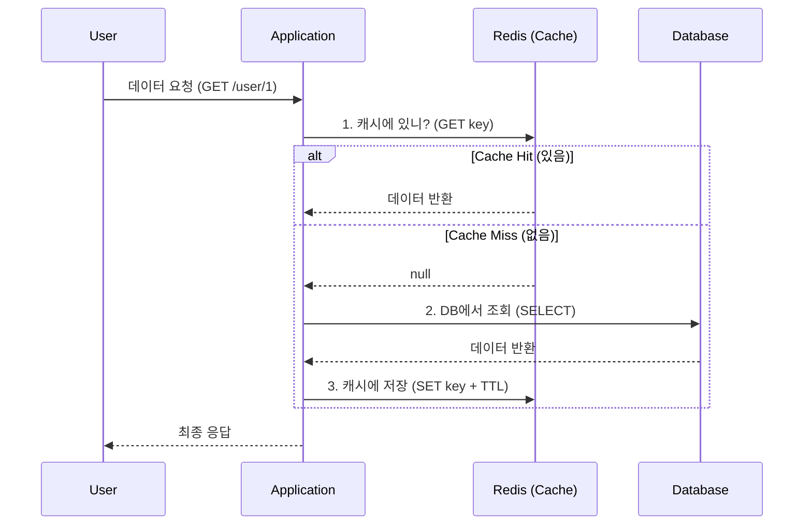

# 초고속 데이터 접근: 캐싱 전략(Caching Strategies)과 Redis 패턴

## 1. 핵심 요약 (Executive Summary)

데이터베이스(Disk)는 메모리(RAM)보다 수십만 배 느리다. 파레토 법칙에 따라 **자주 조회되는 20%의 데이터(Hot Data)**를 빠른 메모리(Cache)에 저장해 두면 전체 시스템 성능을 비약적으로 높일 수 있다.

> **결론:**
> 1. **읽기 전략:** 기본적으로 **Look-aside (Lazy Loading)** 패턴을 사용한다.
> 2. **쓰기 전략:** 데이터 정합성이 중요하면 **Write-through**, 쓰기 성능이 중요하면 **Write-back**을 고려한다.
> 3. **주의:** 캐시는 영구 저장소가 아니므로 언제든 날아갈 수 있음을 전제해야 하며, **만료 시간(TTL)** 설정이 필수다.
> 
> 

---

## 2. 주요 캐싱 전략 (Patterns)

### 2.1 Look-aside (Lazy Loading)

**가장 범용적이고 표준적인 방식.** 대부분의 웹 서비스는 이 방식을 기본으로 채택한다.

* **동작:** 앱이 데이터를 찾을 때 **캐시를 먼저 본다.**
* **Hit:** 캐시에 있으면 바로 반환 (DB 부하 0).
* **Miss:** 없으면 **DB에서 조회**한 뒤, 캐시에 저장하고 반환.


* **장점:** 캐시가 죽어도 DB에서 조회하면 되므로 서비스 전체 장애로 번지지 않음. (Resilience)
* **단점:** 캐시 미스(Miss)가 발생하면 DB 조회를 거치므로 초기 응답이 느림(Cache Warming 필요).



### 2.2 Write-through

데이터를 쓸 때 **캐시와 DB에 동시에** 쓰는 방식.

* **장점:** 캐시와 DB가 항상 동기화되어 데이터 **일관성(Consistency)**이 높음.
* **단점:** 쓸 때마다 두 곳에 저장해야 하므로 **쓰기 지연(Latency)**이 발생. 자주 조회되지 않는 데이터도 캐시에 들어가 메모리를 낭비함.

### 2.3 Write-back (Write-behind)

캐시에만 먼저 쓰고, 나중에 비동기적으로 DB에 한꺼번에 저장(Batch)하는 방식.

* **장점:** 쓰기 성능이 극도로 빠름 (로그 수집, 클릭 수 집계 등).
* **단점:** 캐시 서버가 꺼지면 **데이터가 영구 소실**될 위험이 큼.

---

## 3. 치명적인 문제: Thundering Herd (Cache Stampede)

캐시를 운영할 때 반드시 대비해야 할 재앙적인 시나리오다.

### 3.1 현상

인기 있는 검색어(Hot Key)의 **TTL(만료 시간)이 끝나는 순간**, 수천 개의 요청이 동시에 들어온다.

1. 모든 요청이 동시에 "캐시에 없네?"(Cache Miss)라고 판단.
2. 수천 개의 요청이 동시에 **DB를 타격**.
3. DB CPU가 100%를 치고 사망  서비스 전면 장애.

### 3.2 해결책

1. **TTL Jitter:** 만료 시간을 똑같이 설정하지 않고 랜덤 값(예: 600초 + 0~60초)을 추가하여 분산시킨다.
2. **Probabilistic Early Recomputation:** 만료되기 전에 확률적으로 미리 갱신한다.

---

## 4. Production-Ready Code Example (Python)

단순한 캐싱이 아니라, **"접속 실패 시 예외 처리"**와 **"TTL 설정"**이 포함된 실무 코드다.

```python
import redis
import json
from datetime import timedelta

# Redis 연결 설정 (Time-out 필수)
r = redis.Redis(host='localhost', port=6379, db=0, socket_timeout=5)

def get_user_profile(user_id):
    cache_key = f"user:profile:{user_id}"
    
    # 1. Look-aside: 캐시 조회
    try:
        cached_data = r.get(cache_key)
        if cached_data:
            return json.loads(cached_data) # Cache Hit
    except redis.ConnectionError:
        # 캐시 서버가 죽어도 서비스는 돌아가야 함 (Fail-safe)
        pass 

    # 2. DB 조회 (Cache Miss or Error)
    # user_data = db.query("SELECT * FROM users WHERE id = %s", user_id)
    user_data = {"id": user_id, "name": "Gemini", "role": "AI"} # Mock DB

    # 3. 캐시 저장 (반드시 TTL 설정!)
    try:
        # 10분(600초) + Jitter(랜덤 0~60초) 권장
        r.setex(cache_key, timedelta(minutes=10), json.dumps(user_data))
    except redis.ConnectionError:
        pass

    return user_data

```

---

## 5. 전문가적 조언 (Pro Tip)

### 5.1 `KEYS *` 명령어 금지

Redis는 **싱글 스레드(Single Threaded)** 기반이다.

* 만약 데이터가 1억 개인데 `KEYS *`(모든 키 조회)를 날리면, 그 명령을 처리하느라 다른 모든 요청(로그인, 결제 등)이 **멈춘다(Block).**
* **대안:** `SCAN` 명령어를 사용하여 커서(Cursor) 방식으로 조금씩 조회해야 한다.

### 5.2 메모리 관리 정책 (Eviction Policy)

Redis 메모리가 꽉 차면 어떻게 할 것인가? `redis.conf` 설정이 중요하다.

* **`noeviction`:** (기본값) 에러를 뱉고 저장을 거부함. (위험)
* **`allkeys-lru`:** (추천) **가장 오랫동안 안 쓴(Least Recently Used)** 데이터부터 지우고 새 데이터를 저장. 캐시 용도에 가장 적합.
* **`volatile-lru`:** TTL이 설정된 키 중에서만 LRU로 삭제.

### 5.3 Local Cache vs Global Cache

* **Global Cache (Redis):** 모든 서버가 공유. 데이터 정합성 좋음. 네트워크 비용 발생.
* **Local Cache (Ehcache, Caffeine):** 서버 메모리에 직접 저장. 속도 가장 빠름. 서버 간 데이터 불일치 발생 가능.
* **전략:** 자주 바뀌지 않는 데이터(코드성 데이터, 공통 설정)는 로컬 캐시에, 자주 바뀌는 데이터는 Redis에 저장하는 **2-Level Caching** 전략이 유효하다.

