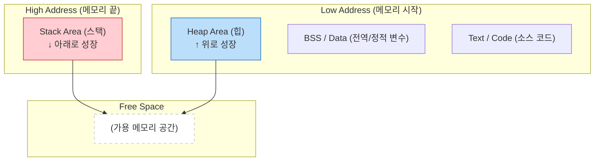

# 컴퓨터의 메모리 구조: 스택(Stack)과 힙(Heap)

## 1. 핵심 요약 (Executive Summary)

프로그램이 실행될 때 운영체제(OS)로부터 메모리 공간을 할당받는데, 이 공간은 크게 **정적 영역(Static)**과 **동적 영역(Dynamic)**으로 나뉜다. 그중 데이터가 저장되는 핵심 구역이 바로 **스택(Stack)**과 **힙(Heap)**이다.

> **결론:**
> * **Stack:** "함수 실행을 위한 임시 작업대". 매우 빠르고, 엄격하며, 자동으로 정리된다. (지역변수, 매개변수)
> * **Heap:** "데이터를 위한 자유 저장소". 크고 유연하지만, 관리가 필요하고 상대적으로 느리다. (객체, 인스턴스)
> * **Rule:** 성능 민감한 루프 안에서는 불필요한 Heap 할당(객체 생성)을 최소화하고 Stack을 활용하는 것이 업계 표준 최적화 기법이다.
> 
> 

---

## 2. 구조 및 특징 비교 (Comparison)

| 구분 | 스택 (Stack) | 힙 (Heap) |
| --- | --- | --- |
| **구조** | **LIFO** (Last In, First Out) <br>

<br> 책을 쌓아 올린 형태 | **랜덤 접근** (Random Access) <br>

<br> 넓은 창고에 물건을 흩뿌려 둔 형태 |
| **속도** | **매우 빠름** (CPU가 직접 관리, 포인터만 이동) | **상대적으로 느림** (빈 공간을 찾고, 할당하고, 정리하는 오버헤드 존재) |
| **관리 주체** | **OS / 컴파일러** (함수가 끝나면 자동 소멸) | **개발자 / 가비지 컬렉터(GC)** (수동 해제하거나 GC가 돌 때까지 남음) |
| **크기** | 작고 제한적 (보통 수 MB 단위) | 시스템 메모리(RAM)가 허용하는 만큼 큼 |
| **저장 데이터** | 지역 변수, 매개변수, 리턴 주소 (원시 타입) | `new`로 생성된 객체, 인스턴스, 배열 (참조 타입) |
| **주요 에러** | `Stack Overflow` (재귀 깊이 초과) | `Out of Memory` (메모리 누수) |

---

## 3. 메모리 레이아웃 시각화 (Memory Layout)

일반적인 프로세스의 메모리 구조입니다. Stack과 Heap은 서로를 향해 자라나는 구조를 가집니다.



---

## 4. 코드로 보는 저장 위치 (Code vs Memory)

코드를 작성할 때 변수가 어디에 박히는지 알아야 합니다. (Java/C++ 기준 일반론)

```java
public void method() {
    // 1. Stack에 저장
    // 함수 실행 중에만 잠깐 필요한 정수값
    int age = 30; 

    // 2. Heap & Stack 동시 사용
    // 'user' 변수(참조값/주소)는 Stack에 생성됨.
    // 실제 'User' 객체(데이터 덩어리)는 Heap에 생성됨.
    // Stack의 'user'가 Heap의 객체를 가리킴(Point).
    User user = new User("Gemini"); 
}
// 3. 함수 종료 시:
// Stack에 있는 'age'와 'user'(주소)는 즉시 팝(Pop)되어 사라짐.
// Heap에 있는 'User 객체'는 덩그러니 남았다가 나중에 GC가 청소함.

```

### 4.1 시각적 상세 분석 (The Pointer)

```text
[ Stack Frame: method() ]             [ Heap Memory ]
+---------------------+               +--------------------------+
| age : 30            |               |                          |
+---------------------+               |  Address: 0x5F3A         |
| user: 0x5F3A  --------------------> |  [ User Object ]         |
+---------------------+               |  name: "Gemini"          |
                                      |  ...                     |
                                      +--------------------------+

```

---

## 5. 발생하는 문제들과 원인

### 5.1 스택 오버플로우 (Stack Overflow)

Stack은 크기가 고정되어 있습니다(예: 1MB). 함수가 끝나지 않고 계속 호출되면(무한 재귀), Stack 영역을 꽉 채워 터져버립니다.

* **원인:** 탈출 조건 없는 재귀 함수(Recursion), 너무 큰 지역 변수 배열 선언.
* **시각화:** 컵에 물을 계속 따르는 것과 같음.

### 5.2 메모리 누수 (Memory Leak)

Heap에 객체를 만들었는데, 더 이상 쓰지 않음에도 불구하고 지우지 않거나(C/C++), 참조를 끊지 않아 GC가 수거하지 못하는(Java/Python) 상황입니다.

* **현상:** 프로그램이 오래 켜져 있으면 점점 느려지다가 멈춤(Out of Memory).
* **시각화:** 도서관에서 책(Heap)을 꺼내고 반납(Free)하지 않아, 나중에는 더 이상 책을 빌릴 수 없는 상태.

---

### 6.1 성능 최적화: 지역 변수의 힘

Stack은 메모리 할당/해제 속도가 Heap보다 월등히 빠릅니다(단순히 포인터만 위아래로 움직임).

* **Tip:** 함수의 파라미터나 내부 연산 변수는 가능한 객체(Heap)보다는 원시 타입(Primitive Type - Stack)을 사용하는 것이 성능상 유리합니다.

### 6.2 참조(Reference)의 이해

"변수를 복사해서 넘겼는데 원본이 바뀌었어요!"라는 초보적인 실수는 Stack과 Heap의 관계를 몰라서 발생합니다.

* **Call by Value:** 값을 복사해서 Stack에 새로 만듦. (원본 영향 X)
* **Call by Reference:** Heap에 있는 주소값만 복사해서 Stack에 만듦. (주소를 따라가면 같은 객체이므로 원본 영향 O)

### 6.3 재귀(Recursion) 대신 반복문(Iteration)

실무(Production) 환경, 특히 임베디드나 고가용성 서버에서는 깊은 재귀 호출을 피해야 합니다. Stack 크기는 예측하기 어렵기 때문입니다. 가능하면 `for`나 `while` 반복문으로 대체하거나, **꼬리 재귀 최적화(Tail Call Optimization)**를 지원하는지 확인해야 합니다.
