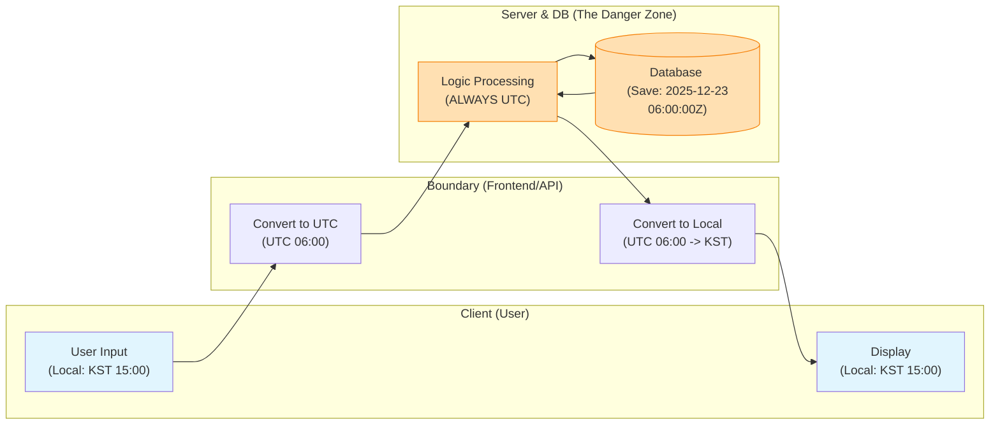

# 컴퓨터의 시간 표현: Unix Timestamp와 타임존의 악몽

## 1. 핵심 요약 (Executive Summary)

컴퓨터에게 시간은 '시계'가 아니라 **'카운터(Counter)'**다. 현대 컴퓨팅 환경, 특히 글로벌 서비스에서는 서버의 로컬 시간(Local Time)을 사용하면 데이터 정합성이 100% 깨진다.

> **결론 (Golden Rule):**
> 1. **저장(Storage) & 연산:** 무조건 **UTC(협정 세계시)** 기준의 **Unix Timestamp**나 **UTC DateTime**을 사용한다.
> 2. **전송(Transfer):** **ISO 8601** 표준 포맷(`YYYY-MM-DDTHH:mm:ssZ`)을 사용한다.
> 3. **표시(Display):** 사용자의 눈에 보여주는 **마지막 순간(Frontend)**에만 브라우저/OS 설정을 읽어 로컬 시간으로 변환한다.
> 
> 

---

## 2. 컴퓨터가 시간을 세는 법: Unix Time

컴퓨터는 "2025년 12월 23일"이라는 복잡한 달력 개념을 이해하지 못한다. 대신 **기준점으로부터 흐른 초(Second)**를 센다.

* **Epoch Time (기원):** 1970년 1월 1일 00:00:00 UTC
* **방식:** 위 기준점으로부터 매초 `+1`씩 정수(Integer)를 증가시킴.

### 2.1 왜 이렇게 하는가?

* **계산의 단순함:** "내일 - 오늘 = 86400초". 날짜 계산이 단순 뺄셈으로 끝난다.
* **타임존 무관:** 전 세계 어디서나 Epoch 1700000000초는 동일한 순간이다.

---

## 3. 2038년 문제 (The Year 2038 Problem)

32비트 시스템에서 시간을 다룰 때 발생할 예정인 치명적인 버그다. (제2의 Y2K)

### 3.1 원인: 32비트 정수의 한계

과거 시스템은 시간을 `signed 32-bit integer`로 저장했다.

* **최대값:** 
* **D-Day:** **2038년 1월 19일 03:14:07 UTC**
* **현상:** 이 1초 뒤, 숫자가 오버플로우(Overflow)되어 부호 비트가 1로 바뀌며 **1901년 12월 13일**로 과거 회귀한다.

### 3.2 시각화 (Binary Overflow)

```text
[ The 2038 Apocalypse Simulation ]

Status: 2038-01-19 03:14:07 UTC
Binary: 01111111 11111111 11111111 11111111  (Max 32-bit Signed Int)
Value : 2,147,483,647

       [ +1 Second passes... ]

Status: 1901-12-13 20:45:52 UTC (CRASH!)
Binary: 10000000 00000000 00000000 00000000  (Sign bit flips to negative)
Value : -2,147,483,648

```

> **해결책:** 현대의 모든 서버와 DB는 **64-bit integer**를 사용하여 시간을 저장해야 한다. (64비트의 수명은 우주의 나이보다 길다.)

---

## 4. 타임존(Timezone)과 'UTC Sandwich' 전략

개발자가 가장 많이 겪는 버그는 **"DB에는 9시로 저장됐는데, 조회하니 18시로 나오는"** 시차 문제다. 이를 해결하는 유일한 아키텍처 패턴은 **UTC Sandwich**다.

### 4.1 UTC Sandwich 다이어그램

데이터가 시스템을 통과할 때 **양쪽 빵(입/출력)만 로컬 시간**이고, **속 재료(서버/DB)는 무조건 UTC**여야 한다는 원칙이다.



---

## 5. 표준 포맷: ISO 8601

API 통신 시 "2025/10/11" 같은 모호한 포맷(미국은 10월, 영국은 11월로 해석)을 쓰면 안 된다. 국제 표준인 **ISO 8601**을 사용하라.

### 5.1 구조 설명

* `T`: 날짜와 시간의 구분자 (Separator)
* `Z`: **Zulu Time** (UTC+0임을 명시). 이 자리에 `+09:00` 처럼 오프셋이 올 수도 있다.

---

## 6. Production-Ready Code Example (Python)

**[Bad Case]**

```python
import datetime

# 치명적 실수: 서버의 로컬 시간을 그대로 저장
# 서버가 한국에 있으면 KST, 미국에 있으면 EST로 저장됨. 데이터 꼬임의 시작.
now = datetime.datetime.now() 
print(now) # 2025-12-23 16:30:00 (KST라고 가정)

```

**[Good Case - Industry Standard]**

```python
from datetime import datetime, timezone
import json

def get_current_event():
    # 1. 생성: 무조건 UTC로 생성 (Timezone Aware 객체)
    # now() 대신 now(timezone.utc)를 사용하는 습관 필수
    utc_now = datetime.now(timezone.utc)
    
    # 2. 전송: ISO 8601 문자열 포맷팅
    # 프론트엔드가 가장 처리하기 쉬운 형태
    iso_format = utc_now.isoformat().replace("+00:00", "Z")
    
    return {
        "event_name": "Login",
        "timestamp": utc_now.timestamp(), # 내부 연산용 (float)
        "created_at": iso_format          # 외부 전송용 (string)
    }

data = get_current_event()
print(json.dumps(data, indent=2))

# Output:
# {
#   "event_name": "Login",
#   "timestamp": 1766478852.123456,
#   "created_at": "2025-12-23T07:34:12.123456Z"
# }

```

---


1. **서버 시간 설정:** 리눅스 서버의 시간(`date` 명령어)을 KST로 맞추지 마십시오. **서버의 시스템 시간은 항상 UTC**로 설정하는 것이 원칙입니다. 로그 파일의 시간대가 섞이는 재앙을 막을 수 있습니다.
2. **DB 컬럼 타입:**
* MySQL: `TIMESTAMP` (내부적으로 UTC 변환 저장) vs `DATETIME` (입력값 그대로 저장). **`TIMESTAMP`**를 쓰거나, 앱 레벨에서 UTC로 변환 후 `DATETIME`에 넣으십시오.
* PostgreSQL: 무조건 **`TIMESTAMPTZ`** (Timestamp with time zone)를 사용하십시오. 그냥 `TIMESTAMP`는 쓰지 마십시오.


3. **윤초(Leap Second):** 지구가 자전하는 속도가 미세하게 느려져서 가끔 1초를 더하는 윤초가 발생합니다. 금융권이나 정밀 과학 분야가 아니라면, OS(NTP 서버)가 알아서 처리하도록 두고 신경 쓰지 않아도 됩니다(Smeared time).

